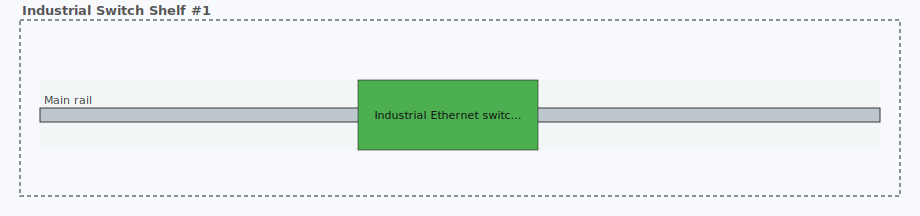
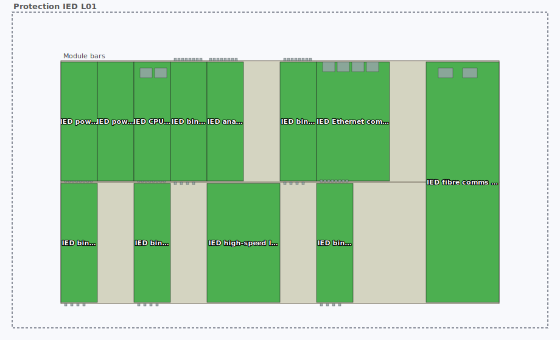
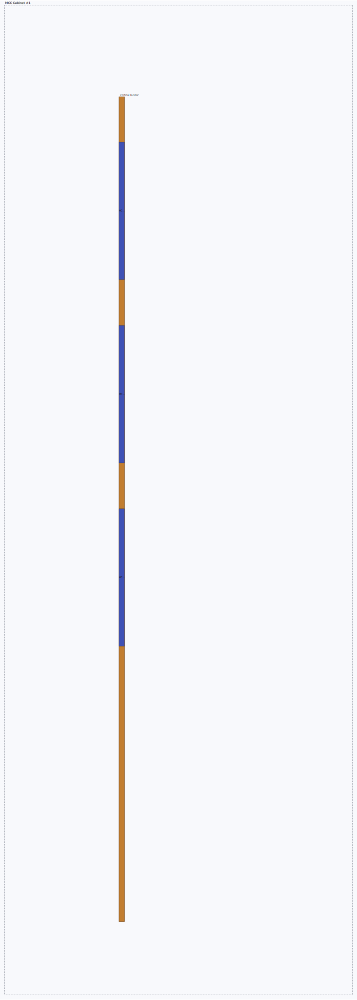
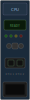
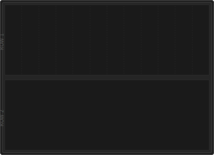

# netbox-cabinet-view

A NetBox plugin that models physical mounting that doesn't fit a 19″ rack — DIN rails, Eurocard subracks, mounting plates, busbars, and multi-row grids — and renders each cabinet as an SVG drawing inside NetBox itself.

## Preview

Every image below is a live SVG served by the plugin's own endpoint, rendered against real seeded demo data on a running NetBox instance. Dark mode follows the parent page automatically.

### Rack elevation — with cabinet interiors embedded in place

The plugin patches NetBox's core `RackElevationSVG` so every carrier-hosting shelf renders its own interior **inside its U slot on the rack elevation**, on both the front and rear faces:

| Rack front | Rack rear |
|---|---|
|  |  |

The embedded interiors are rendered in thumbnail mode (diminished contrast, no per-placement labels) so they read as "preview — open the Layout tab to interact" rather than pretending each little rectangle is a click target. Full-fidelity rendering is one click away on the device's Layout tab.

### Industrial switch with port overlay — status-coloured interface pins



An 8-port managed switch on a DIN rail, with the v0.7.0 **port/connector overlay** rendering each `dcim.Interface` as a clickable pin. Green = connected + enabled, grey = unconnected, dark grey = disabled, amber = connected + disabled. Click a pin to jump to the interface detail page.

### Modular IED chassis — two-level module-bay overlay



A 2-row × 12-slot protection IED with PSU, CPU, binary I/O, analog I/O, Ethernet, and fibre comms modules. The host device's `port_map` defines where each module bay sits; each installed module's own `port_map` defines its pin positions. Protruding spring-cage terminals (DI/DO/AI) extend beyond the module bounds.

### MCC cabinet — nested SVG recursion



A motor control center with three withdrawable buckets on a vertical busbar. Each bucket is itself a mount-host with its own DIN rail, contactor, and auxiliary relays rendered inline via nested SVG recursion (up to 3 levels deep).

> Want to see the rest? The full gallery (20+ scenarios covering DIN rails, subracks, mounting plates, busbars, grid mounts, vertical orientations, MCC buckets, VFD cabinets, modular IEDs, ODF frames, safety panels, fieldbus I/O, …) lives in [`docs/scenarios.md`](docs/scenarios.md).

## Compatibility

| NetBox version | Supported | Tested | Notes |
|---|:---:|:---:|---|
| **4.5.x** | ✅ | ✅ | Actively developed against 4.5.7 — this is the version all screenshots and smoke tests run against |
| **4.4.x** | ✅ | ⚠️ | Untested but all APIs used (`NetBoxModel`, `ViewTab`, `register_model_view`, `get_model_urls`, `PluginTemplateExtension.models`, HTMXSelect pattern) are present in 4.4.0; no code changes expected |
| 4.3.x and older | ❌ | ❌ | Not supported — some helpers we rely on may not exist or have different signatures |
| 4.6.x (when released) | ❓ | ❓ | To be verified when released |

Python 3.10+ required.

### Browser compatibility

| Browser | Status | Notes |
|---|:---:|---|
| **Chrome / Chromium** | ✅ | Fully supported — dark/light theme toggle updates SVGs live |
| **Firefox** | ✅ | Fully supported |
| **Safari** | ⚠️ | Theme toggle does not reliably update already-loaded SVGs due to aggressive `<object>` caching. Workaround: refresh the page after toggling. Initial page loads are always correct. |

## Install

```bash
pip install netbox-cabinet-view
```

Add to your NetBox `configuration.py`:

```python
PLUGINS = ['netbox_cabinet_view']
```

Then run migrations and restart NetBox:

```bash
python manage.py migrate netbox_cabinet_view
python manage.py collectstatic --no-input
```

A **Cabinet View** entry appears in the sidebar, and every `dcim.Device` detail page whose `DeviceType` has `hosts_mounts=True` grows a **Layout** tab. Unprofiled `u_height=0` devices show a soft discovery hint card in the right column pointing users at profile creation.

## Using it

1. Create a `DeviceMountProfile` for any DeviceType that **hosts** mounts (set `hosts_mounts=True` and the internal dimensions in mm). *Or click the discovery hint card on a cabinet-shaped Device detail page and follow the guided flow.*
2. Create a `DeviceMountProfile` for any DeviceType that **mounts on** other mounts (set `mountable_on`, `mountable_subtype`, and `footprint_primary` in mount units). Placement `size` is optional — it auto-fills from the profile's `footprint_primary`.
3. *Optional:* create a `ModuleMountProfile` for any `dcim.ModuleType` that you want rendered at its real width inside a modular chassis.
4. Create a `Device` of the host type, place it in a Location or a Rack as normal.
5. Add one or more `Mount` records to the host device — DIN rail at offset (x, y) with a length, or a mounting plate with width×height, etc.
6. Add `Placement` records to place devices / device bays / module bays on the mounts at specific positions. The form adapts to the selected mount's type: 1D mounts get just `position`/`size`, grid mounts add `row`/`row_span`, 2D mounts switch to `position_x/y` + `size_x/y`. Target dropdowns are compatibility-filtered to valid unoccupied devices and bays.
7. Visit the host device's detail page → **Layout** tab.

**Faster add-placement shortcut:** click any empty slot on the rendered layout. 1D and grid mounts turn every unoccupied slot range into a click target; 2D mounting plates accept click-anywhere coordinates. The placement form opens pre-filled with the mount and position.

## Port / connector overlay

Every interface, front port, and rear port on a placed device or module can be rendered as a **clickable, status-coloured hotspot** directly on the front-panel image:

- **Green** — connected + enabled
- **Amber** — connected + disabled
- **Grey** — unconnected + enabled
- **Dark grey** — disabled

Define port positions on the profile via a `port_map` JSON field — either as **zones** (repetitive terminal blocks with pitch and protrusion) or **individual pins** at exact coordinates. Protruding spring-cage connectors (DI/DO/AI/AO terminals) extend beyond the device bounding box for realistic rendering. Click any pin to jump to the interface detail page.

For modular devices (IEDs, PLCs), a **two-level overlay** composites the host device's module-bay positions with each installed module's own pin layout — no manual per-device configuration needed.

Colour mapping is configurable via `PORT_STATUS_COLORS` in `PLUGINS_CONFIG`. Health indicators from external monitoring sources are planned for a future release.

## Drag-to-place

Grab any placed device on the Layout tab SVG and **drag it to a new position**. A ghost rectangle follows the cursor, snapping to the mount's grid. On drop, the position updates via the REST API without a page reload. Works on 1D rails (snap to mount units), 2D plates (snap to mm), and grid mounts (snap to row + position).

## Bundled line-art

The plugin ships 65 generic front-panel SVGs — de-branded, multi-vendor-inspired — as ready-to-use placeholder images. Upload them to `ModuleMountProfile.front_image` (modules) or `DeviceType.front_image` (host devices) so your layouts render with real panel art instead of plain colored rectangles:

| IED CPU module | RTU DI module | SFP fibre face | IED chassis |
|---|---|---|---|
|  |  |  |  |

Auto-assign to all demo profiles: `python manage.py cabinetview_assign_lineart`

Browse the full library: [`docs/line-art.md`](docs/line-art.md) — 15 categories covering IED modules (4 manufacturer families), RTU modules (4 variants), PLC/fieldbus I/O, SFP/QSFP transceivers, DIN-rail devices, network switches and routers (DIN-mount + 1U rack-mount), busbar components, cable management, and host chassis.

## Demo data

```bash
python manage.py cabinetview_seed
```

Idempotent. Creates one `Site`, one `Rack`, ~30 `DeviceType`s with profiles, and 20 demo scenarios. The seed also auto-assigns bundled line-art to all matching profiles, so the demo scenarios render with panel images out of the box. See [`docs/scenarios.md`](docs/scenarios.md) for the full list.

## Advanced topics

The sections below live in [`docs/`](docs/) to keep this README scannable:

- [`docs/architecture.md`](docs/architecture.md) — the four plugin models (`DeviceMountProfile`, `ModuleMountProfile`, `Mount`, `Placement`), the Mermaid ER schema, the three-way XOR explainer, and the validation rules enforced in `Placement.clean()`.
- [`docs/scenarios.md`](docs/scenarios.md) — the full 20-scenario demo gallery with tables describing each scenario, plus OT/ICS coverage and ISP-specific notes.
- [`docs/certification-ratings.md`](docs/certification-ratings.md) — why environmental / certification metadata (IP, NEMA, Ex, temperature, SIL, fire, seismic, …) lives in NetBox custom fields instead of plugin models, with a recommended baseline of fields to create on `dcim.rack` and `dcim.devicetype`.
- [`docs/offline.md`](docs/offline.md) — how the plugin is fully offline-safe at runtime (no CDNs, no external fonts, no runtime HTTP calls) for OT/ICS / air-gapped / classified deployments.
- [`docs/line-art.md`](docs/line-art.md) — the bundled library of generic, de-branded front-panel SVGs that ship as ready-to-use placeholder images for modules and host devices.
- [`docs/roadmap.md`](docs/roadmap.md) — deferred features (Krone LSA, strut channel, Okabe-Ito palette, port health from external sources, auto-scrape port coordinates from devicetype-library, …) and what is explicitly NOT on the roadmap (environmental custom fields, standard 19″ patch cabling).

## Security & supply chain

Every release ships with machine-readable supply-chain documents under [`security/`](security/):

- **[`security/sbom.cdx.json`](security/sbom.cdx.json)** — [CycloneDX 1.6](https://cyclonedx.org/docs/1.6/json/) Software Bill of Materials with purl identifiers for `grype` / `trivy` / `osv-scanner` / Dependency-Track / GitHub's dependency graph.
- **[`security/openvex.json`](security/openvex.json)** — [OpenVEX 0.2.0](https://openvex.dev/) Vulnerability Exploitability eXchange document. No known CVEs affect the plugin or its sole runtime dependency `svgwrite`.

**Reporting a vulnerability:** please open a private [Security Advisory](https://github.com/TheFlyingCorpse/netbox-cabinet-view/security/advisories) on GitHub rather than a public issue.

## License

Apache-2.0. See [LICENSE](LICENSE).
