# netbox-cabinet-view

A NetBox plugin that models physical mounting that doesn't fit a 19″ rack — DIN rails, Eurocard subracks, mounting plates, and busbars — and renders each cabinet as an SVG drawing with real device images.

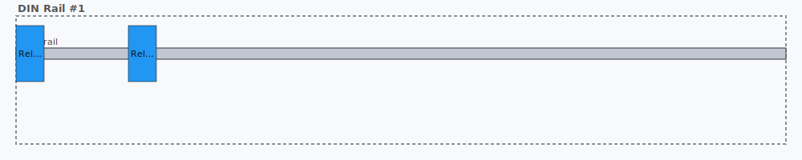
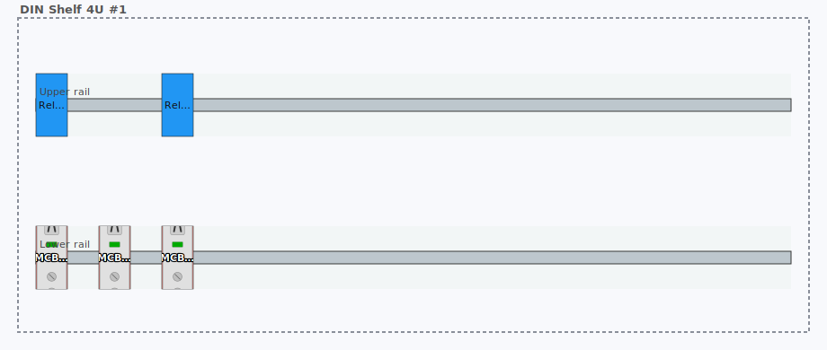
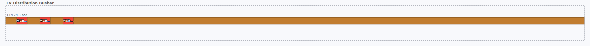

*(Above: three of the 16 demo scenarios seeded by `manage.py cabinetview_seed`. Every drawing is a live SVG rendered from the plugin's own endpoint — they flip to a dark palette automatically when your browser is in dark mode.)*

## Compatibility

| NetBox version | Supported | Tested | Notes |
|---|:---:|:---:|---|
| **4.5.x** | ✅ | ✅ | Actively developed against 4.5.7 — this is the version all screenshots and smoke tests run against |
| **4.4.x** | ✅ | ⚠️ | Untested but all APIs used (`NetBoxModel`, `ViewTab`, `register_model_view`, `get_model_urls`, `PluginTemplateExtension.models`) are present in 4.4.0; no code changes expected |
| 4.3.x and older | ❌ | ❌ | Not supported — some helpers we rely on may not exist or have different signatures |
| 4.6.x (when released) | ❓ | ❓ | To be verified when released |

Python 3.10+ required (matches NetBox 4.4 / 4.5's own Python support).

## What it adds

Three models:

- **DeviceTypeProfile** — per-DeviceType declaration of whether the device hosts carriers (i.e. it's a cabinet or enclosure) and/or mounts on carriers (it's a DIN-mounted relay, a 4-HP Eurocard, a clip-on MCB). Internal dimensions and footprints live here.
- **Carrier** — a geometric mounting structure attached to a host `Device`. Four types ship in v1: `din_rail`, `subrack`, `mounting_plate`, `busbar`. Each has offset, orientation, length (1D) or width/height (2D), and a unit (mm, DIN module 17.5 mm, Eurocard HP 5.08 mm).
- **Mount** — a placement on a carrier. Points at exactly one of:
  - a standalone `dcim.Device` (bare DIN rail mounts)
  - a `dcim.DeviceBay` (chassis with child devices — e.g. a WDM shelf with two filter modules)
  - a `dcim.ModuleBay` (modular PLC / line-card chassis)

And three views:

- A **Layout** tab on every `dcim.Device` detail page. Renders the host's carriers and their mounts as an SVG via `svgwrite`, reusing `DeviceType.front_image` and `ModuleType.front_image` from core NetBox. Falls back to colored rectangles with labels when no image is available.
- A **Cabinet Layouts** panel on every `dcim.Rack` detail page, listing all carrier-host devices in the rack and embedding each one's layout SVG inline.
- **Rack elevation integration** (v0.2.0+): the plugin monkey-patches `dcim.svg.racks.RackElevationSVG.draw_device_front` at startup so that ≥2U devices with `hosts_carriers=True` render their cabinet layout **inside the rack elevation at their U slot**, instead of the stock `DeviceType.front_image`. Letterboxed with `xMidYMid meet` so the layout keeps its natural aspect ratio. Falls back to the stock front image for 1U devices (a 230×22 px slot is too narrow for a useful layout). Cache-busted by a content hash of the host's carriers and mounts, so edits invalidate the browser cache. Opt out with `PLUGINS_CONFIG['netbox_cabinet_view']['PATCH_RACK_ELEVATION'] = False`.

## Schema

Plugin models are in bold, core NetBox models are shown as context. The three dashed relationships from `Mount` form an **XOR constraint** — exactly one of them must be populated on any given mount, enforced in `Mount.clean()`.

```mermaid
erDiagram
    Device             }o--o| Rack         : "rack / position / face"
    Device             }o--|| DeviceType   : "device_type"
    Module             }o--|| ModuleType   : "module_type"
    DeviceBay          }o--|| Device       : "parent device"
    DeviceBay          |o--o| Device       : "installed_device (child)"
    ModuleBay          }o--|| Device       : "parent device"
    ModuleBay          |o--o| Module       : "installed_module"

    DeviceType         ||--o| DeviceTypeProfile : "cabinet_profile (1:1)"
    Device             ||--o{ Carrier           : "cabinet_carriers (host)"
    Carrier            ||--o{ Mount             : "mounts"

    Device             |o..o{ Mount             : "device (XOR)"
    DeviceBay          |o..o{ Mount             : "device_bay (XOR)"
    ModuleBay          |o..o{ Mount             : "module_bay (XOR)"

    DeviceTypeProfile {
        OneToOne  device_type
        bool      hosts_carriers
        int       internal_width_mm
        int       internal_height_mm
        int       internal_depth_mm
        enum      mountable_on
        enum      mountable_subtype
        int       footprint_primary
        int       footprint_secondary
    }
    Carrier {
        FK    host_device
        str   name
        enum  carrier_type
        enum  subtype
        enum  orientation
        enum  unit
        int   offset_x_mm
        int   offset_y_mm
        int   length_mm
        int   width_mm
        int   height_mm
    }
    Mount {
        FK    carrier
        FK    device         "nullable"
        FK    device_bay     "nullable"
        FK    module_bay     "nullable"
        int   position       "1D"
        int   size           "1D (auto from profile footprint_primary)"
        int   position_x     "2D"
        int   position_y     "2D"
        int   size_x         "2D"
        int   size_y         "2D"
    }
```

**Why a Mount can target three different things:** NetBox already represents three different parent/child relationships — direct device placement, `DeviceBay`-backed child devices (WDM shelves, blade chassis), and `ModuleBay`-backed modules (modular PLCs, line cards). The cabinet-view model treats each as a valid "thing that occupies a carrier position", so its geometry layer works uniformly across all three.

## OT/ICS coverage

v1 covers the common OT/ICS cabinet types:

| Cabinet kind | Carrier type used |
|---|---|
| PLC cabinets, marshalling/junction boxes, field I/O, IS cabinets, relay panels, small LV distribution | `din_rail` |
| Rittal/Hoffman enclosures with back-mounted VSDs, UPS, contactors, IPCs | `mounting_plate` |
| VME/cPCI/MTCA measurement and controller racks, 3U/6U industrial computing | `subrack` |
| MCCs, LV panelboards, withdrawable switchgear spines (RiLine, 8US, SMISSLINE) | `busbar` |
| Modular PLCs, OLT/WDM line cards, modular router/switch chassis | `subrack` + `ModuleBay` mounts |
| MCC withdrawable buckets, switchgear compartments | nested Device-in-Device-on-Carrier (no new model) |

## Install

```bash
pip install -e /path/to/netbox-cabinet-view
```

Add to your NetBox `configuration.py`:

```python
PLUGINS = ['netbox_cabinet_view']
```

Then run migrations:

```bash
DEVELOPER=1 python manage.py makemigrations netbox_cabinet_view
python manage.py migrate netbox_cabinet_view
python manage.py collectstatic --no-input
```

Restart NetBox. A **Cabinet View** entry appears in the sidebar, and every `dcim.Device` detail page grows a **Layout** tab (hidden when the device has no carriers).

## Using it

1. Create a `DeviceTypeProfile` for any DeviceType that hosts carriers (set `hosts_carriers=True` and the internal dimensions in mm).
2. Create a `DeviceTypeProfile` for any DeviceType that mounts on carriers (set `mountable_on`, `mountable_subtype`, and `footprint_primary` in carrier units). Mount `size` is optional — if left blank it defaults to the profile's `footprint_primary` (slots are fixed-width; only carriers stretch).
3. Create a `Device` of the host type, place it in a Location or a Rack as normal.
4. Add one or more `Carrier` records to the host device — DIN rail at offset (x, y) with a length, or a mounting plate with width×height, etc.
5. Add `Mount` records to place devices (or device bays, or module bays) on the carriers at specific positions.
6. Visit the host device's detail page → **Layout** tab.

## Demo data

The plugin ships a management command that creates a realistic OT/ICS demo dataset for visually testing every feature. It is **not** run automatically on install. To use it:

```bash
python manage.py cabinetview_seed
```

The command is idempotent — safe to re-run, updates drifted fields back to the canonical values, and re-layouts rack positions cleanly. It creates one `Site` (`OT Test Site`), one `Location`, one `Manufacturer` (`Generic`), nine `DeviceRole`s, around 25 `DeviceType`s with matching `DeviceTypeProfile`s, one `Rack` (`Test Rack A`, 24U), and the sixteen scenarios below:

### Core scenarios (9)

| # | Scenario | Host device | Carrier(s) | Mount target | Demonstrates |
|---|---|---|---|---|---|
| 1 | Standalone DIN rail | `DIN Rail #1` | 1× DIN rail (480 mm) | 2× Phoenix REL-MR (Device) | Bare rail with no enclosing cabinet |
| 2 | 2D mounting plate | `Enclosure #1` | 1× mounting plate (760×1960 mm) | 1× Industrial PC (Device, 220×90 mm) | Back-plate with `(x, y)` mm placement |
| 3 | Chassis with child devices | `WDM Shelf #1` | 1× subrack (HP 3U, 406 mm) | 2× WDM Mux/Demux (DeviceBay, slots 1 and 5) | `DeviceBay`-backed mounts, parent/child visualization |
| 4 | Small chassis | `WDM Shelf 2-slot #1` | 1× subrack (HP 3U, 440 mm, full width) | 2× WDM Mux/Demux (DeviceBay, 20 HP each) | Fixed-width slots in a wider carrier |
| 5 | LV panelboard | `LV Panel Busbar` | 1× busbar (1000 mm) | 3× MCB 1P 45 mm (Device, at mm positions) | Copper busbar with clip-on modules |
| 6 | Modular PLC | `PLC Backplane #1` | 1× subrack (HP 3U, 400 mm) | 2× DI 16×24 VDC (ModuleBay) | `ModuleBay`-backed mounts, modular chassis |
| 7 | Rack-mounted DIN shelf (2U) | `DIN Shelf 2U #1` | 1× DIN rail (420 mm, centered) | 3× Phoenix REL-MR (Device) | Realistic 2U DIN shelf for rack-elevation testing |
| 8 | Rack-mounted DIN shelf (4U, two rails) | `DIN Shelf 4U #1` | 2× stacked DIN rails (upper + lower) | 2× Relay + 3× MCB (Device) | Multi-carrier host, stacked rails |
| 9 | ISP-style 4U DIN shelf (single rail) | `DIN Shelf 4U ISP #1` | 1× DIN rail (420 mm, centered vertically) | 5× Phoenix REL-MR (Device) | Single rail with wire-management headroom |

### Classic OT/ICS scenarios (7 extras, v0.1.1+)

| # | Scenario | Host device | Carrier(s) | Mount target | Demonstrates |
|---|---|---|---|---|---|
| A | **Marshalling cabinet** | `Marshalling Cabinet #1` (4U) | 1× DIN rail (mm unit, 420 mm) | 20× Phoenix UT 2.5 terminal block at 6 mm pitch | Dense narrow-slot rendering; label fitting under pressure |
| B | **MCC with withdrawable buckets** | `MCC Cabinet #1` (standalone) | 1× vertical busbar (1800 mm) + nested DIN rails per bucket | 3× `MCC Bucket` devices (each also a carrier host), each with a motor contactor + auxiliary relay | **Device-in-Device recursion** on a busbar; vertical-orientation carrier |
| C | **VFD control cabinet** | `VFD Cabinet #1` (Rittal 600×1800) | 1× mounting plate + nested aux DIN strip | 1× Schneider ATV630 + `aux DIN strip` device holding a 24 V PSU and 2 motor contactors | Mixed plate + DIN; rail-on-plate nesting |
| D | **Wago remote I/O station** | `Wago Remote I/O #1` (2U) | 1× DIN rail (mm unit) | 1× Wago 750-362 coupler + 4× 750-430 DI + 3× 750-530 DO chained along the rail | Bus-coupler-plus-modules pattern on DIN |
| E | **Industrial Ethernet switch panel** | `Industrial Switch Shelf #1` (2U) | 1× DIN rail | 1× Hirschmann MACH1000 (90 mm, wider than 1 module) | Single wider-footprint device on a rail |
| F | **Safety relay panel** | `Safety Panel #1` (600×800 enclosure) | 1× mounting plate | 4× Pilz PNOZ X3 (45×100 mm each) | Multiple fixed-size devices on a 2D plate |
| G | **Substation protection panel** | `Protection Panel #1` (800×2200 cabinet) | 1× mounting plate + nested test block rail | 2× Siemens SIPROTEC 7SJ82 + 1× ABB REL670 + nested test rail with 4× ABB RTXF test blocks | Protective relays / IEDs in a realistic utility protection cabinet; rail-on-plate nesting with its own mounts |

`Test Rack A` (24U) holds the 1U / 2U / 4U rack-mounted scenarios (3, 4, 7, 8, 9, A, D, E) at consecutive U positions. The standalone scenarios (1, 2, 5, 6, B, C, F, G) live in `OT Test Site` / `Control Room` without a rack.

### Rendered scenario gallery

The SVGs below are committed at `docs/screenshots/*.svg` and embedded live — every stroke, fill and label you see is exactly what the plugin's `/dcim/devices/<pk>/cabinet-layout/svg/` endpoint returns for that device.

| Scenario | Rendering |
|---|---|
| **1. Standalone DIN rail** |  |
| **2. Mounting plate + IPC** |  |
| **3. WDM 8-slot shelf (DeviceBay)** | 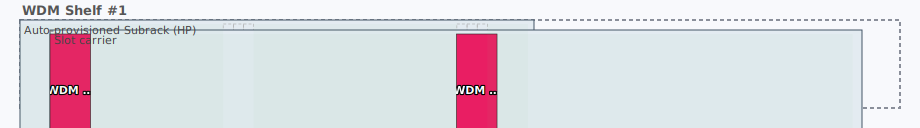 |
| **4. WDM 2-slot shelf** |  |
| **5. LV panelboard busbar** |  |
| **6. Modular PLC (ModuleBay)** | 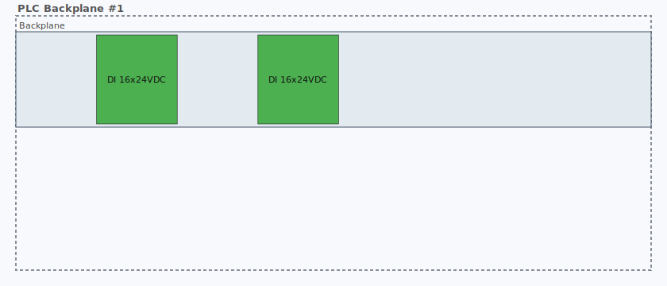 |
| **7. 2U rack DIN shelf** | 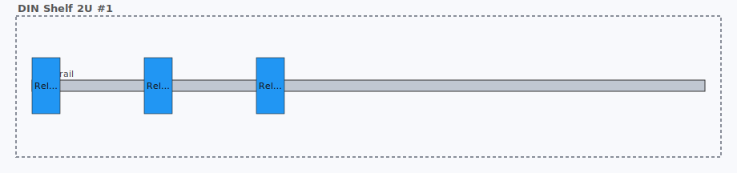 |
| **8. 4U rack DIN shelf — two stacked rails** |  |
| **9. 4U rack DIN shelf — ISP single-rail** | 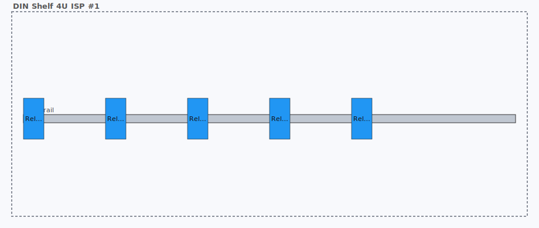 |
| **A. Marshalling cabinet (20 terminal blocks)** | 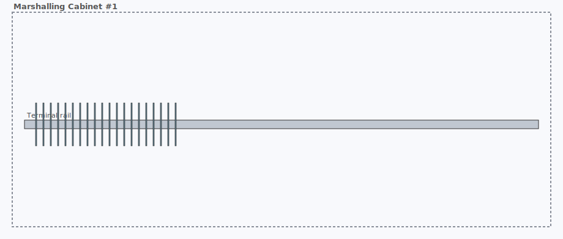 |
| **B. MCC with withdrawable buckets** |  |
| **C. VFD control cabinet** | 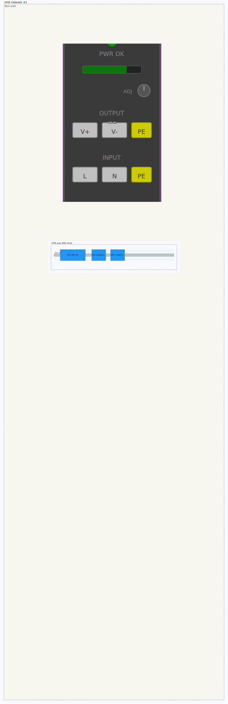 |
| **D. Wago remote I/O station** | 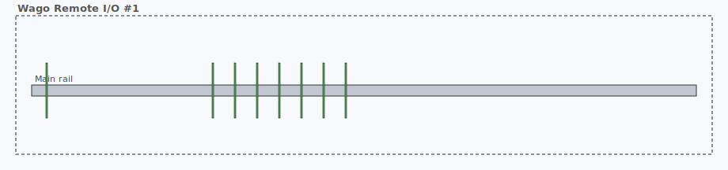 |
| **E. Industrial Ethernet switch** |  |
| **F. Safety relay panel** | 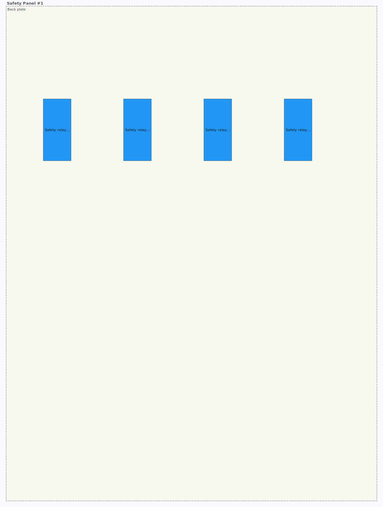 |
| **G. Substation protection panel** |  |

## Security & supply chain

Every release ships with machine-readable supply-chain documents under [`security/`](security/):

- **[`security/sbom.cdx.json`](security/sbom.cdx.json)** — [CycloneDX 1.6](https://cyclonedx.org/docs/1.6/json/) Software Bill of Materials enumerating every direct and transitive runtime dependency, with purl identifiers so it drops straight into Dependency-Track, `grype`, `trivy`, `osv-scanner`, or GitHub's dependency graph.
- **[`security/openvex.json`](security/openvex.json)** — [OpenVEX 0.2.0](https://openvex.dev/) Vulnerability Exploitability eXchange document telling downstream consumers which CVEs actually affect the running code. At v0.1.2 there are no known CVEs affecting the plugin or its sole runtime dependency `svgwrite`.

Both files are regenerated on every tagged release. See [`security/README.md`](security/README.md) for regeneration commands and a summary of current contents.

**Reporting a vulnerability:** please open a private [Security Advisory](https://github.com/TheFlyingCorpse/netbox-cabinet-view/security/advisories) on GitHub rather than a public issue.

## Not in v1

Strut channel, keystone frames, Krone LSA/110-block frames, fiber cassettes, HMI panel cutouts, pneumatic manifolds, auto-provisioning carriers from existing bay templates, drag-to-place UI, REST API, GraphQL.
