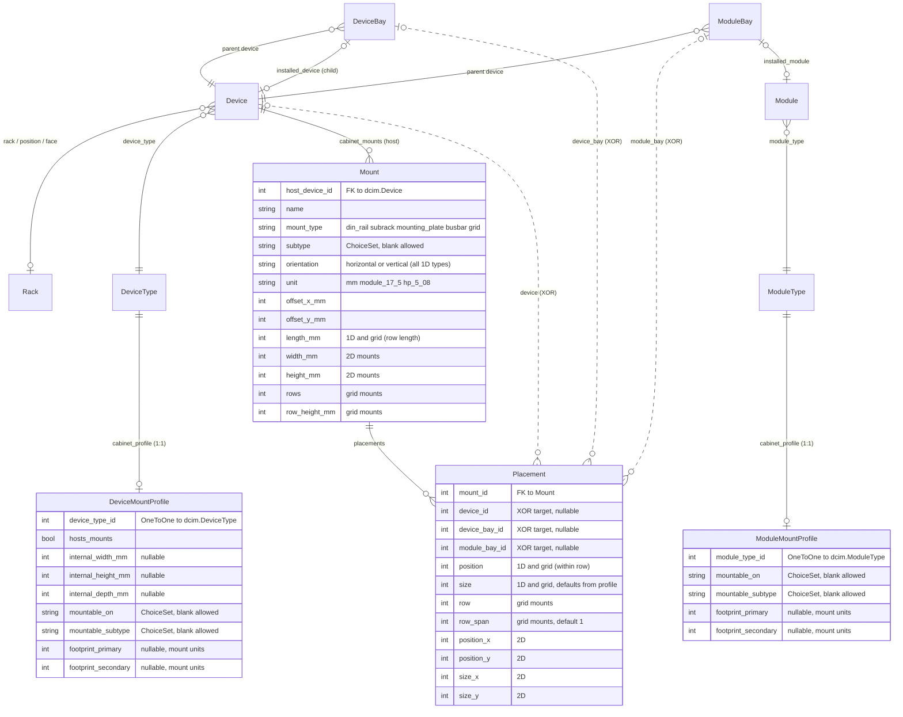
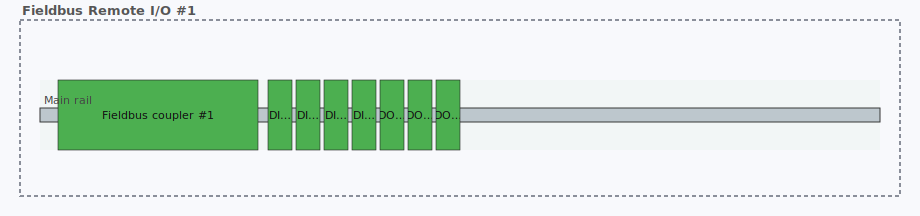
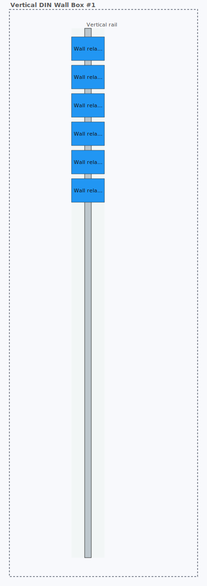
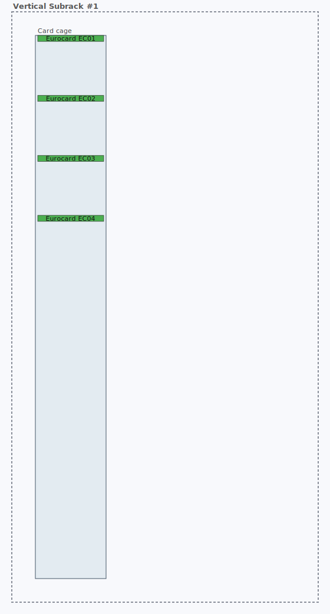
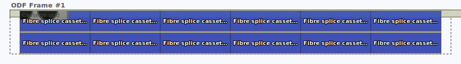

# netbox-cabinet-view

A NetBox plugin that models physical mounting that doesn't fit a 19″ rack — DIN rails, Eurocard subracks, mounting plates, and busbars — and renders each cabinet as an SVG drawing with real device images.


*(Above: four of the 20 demo scenarios seeded by `manage.py cabinetview_seed`. Every drawing is a live SVG rendered from the plugin's own endpoint — they flip to a dark palette automatically when your browser is in dark mode. The third image shows v0.3.0's new `grid` carrier type with a comms module spanning both rows at the right edge.)*

## Compatibility

| NetBox version | Supported | Tested | Notes |
|---|:---:|:---:|---|
| **4.5.x** | ✅ | ✅ | Actively developed against 4.5.7 — this is the version all screenshots and smoke tests run against |
| **4.4.x** | ✅ | ⚠️ | Untested but all APIs used (`NetBoxModel`, `ViewTab`, `register_model_view`, `get_model_urls`, `PluginTemplateExtension.models`) are present in 4.4.0; no code changes expected |
| 4.3.x and older | ❌ | ❌ | Not supported — some helpers we rely on may not exist or have different signatures |
| 4.6.x (when released) | ❓ | ❓ | To be verified when released |

Python 3.10+ required (matches NetBox 4.4 / 4.5's own Python support).

## What it adds

Four models (v0.4.0 renamed `Carrier → Mount` / `Mount → Placement` / `DeviceTypeProfile → DeviceMountProfile` to match how OT engineers actually talk about DIN rails and back plates; also added `ModuleMountProfile`):

- **DeviceMountProfile** — per-DeviceType declaration of whether the device hosts mounts (i.e. it's a cabinet or enclosure) and/or mounts on other mounts (it's a DIN-mounted relay, a 4-HP Eurocard, a clip-on MCB). Internal dimensions and footprints live here.
- **ModuleMountProfile** — per-ModuleType declaration of mount compatibility + footprint. Mirror of `DeviceMountProfile`'s "mountable" role for `dcim.ModuleType`. Unlocks correct widths for modular I/O cards, line cards, fibre cassettes, and other plug-in modules. **New in v0.4.0.**
- **Mount** — a geometric mounting structure attached to a host `Device`. Five types: `din_rail`, `subrack`, `mounting_plate`, `busbar`, `grid`. Each has offset, orientation (horizontal **or vertical** for any 1D type), length (1D) or width/height (2D) or rows/row_height_mm (grid), and a unit (mm, DIN module 17.5 mm, Eurocard HP 5.08 mm). Grid mounts are 1-to-N stacked rows ("bars") for modular IED / multi-row backplanes where a placement can span multiple rows via `row_span`.
- **Placement** — a device placement on a Mount. Points at exactly one of:
  - a standalone `dcim.Device` (bare DIN rail placements)
  - a `dcim.DeviceBay` (chassis with child devices — e.g. a WDM shelf with two filter modules)
  - a `dcim.ModuleBay` (modular PLC / line-card chassis)

And four views:

- A **Layout** tab on every `dcim.Device` detail page whose DeviceType declares `hosts_mounts=True`. Renders the host's mounts and their placements as an SVG via `svgwrite`, reusing `DeviceType.front_image` from core NetBox. Falls back to colored rectangles with labels when no image is available. **v0.4.0:** the tab is visible even when the device has zero mounts yet (empty-state scale-reference canvas with "+ Add the first mount" CTA). Empty slot ranges are click-to-add targets that pre-fill the Placement form. An **opt-in spreadsheet-style slot ledger** renders above the SVG when `PLUGINS_CONFIG['netbox_cabinet_view']['SLOT_LEDGER_ENABLED'] = True`, with ModuleBay sub-rows for hosted devices.
- A **Cabinet Layouts** panel on every `dcim.Rack` detail page, listing all mount-host devices in the rack and embedding each one's layout SVG inline.
- **Rack elevation integration** (v0.2.0+): the plugin monkey-patches `dcim.svg.racks.RackElevationSVG.draw_device_{front,rear}` at startup so that ≥2U devices with `hosts_mounts=True` render their cabinet layout **inside the rack elevation at their U slot**, instead of the stock front/rear image. **v0.4.0 renders these embeds in thumbnail mode** (55% opacity, no labels, desaturated role colors) so they read as "preview — zoom in to interact" rather than pretending each placement rectangle is a click target. Letterboxed with `xMidYMid meet` so the layout keeps its natural aspect ratio. Falls back to the stock front/rear image for 1U devices. Cache-busted by a content hash of the host's mounts and placements. Opt out with `PLUGINS_CONFIG['netbox_cabinet_view']['PATCH_RACK_ELEVATION'] = False`.
- **Discovery hint card** (v0.4.0): a `PluginTemplateExtension` that injects a soft CTA on Device detail pages whose DeviceType looks cabinet-shaped (`u_height == 0`) but has no `DeviceMountProfile` yet. One-click path to creating the profile. Dismissable per-user via `UserConfig`.

## Schema

Plugin models are in bold, core NetBox models are shown as context. The three dashed relationships from `Placement` form an **XOR constraint** — exactly one of them must be populated on any given placement, enforced in `Placement.clean()`.



**Why a Placement can target three different things:** NetBox already represents three different parent/child relationships — direct device placement, `DeviceBay`-backed child devices (WDM shelves, blade chassis), and `ModuleBay`-backed modules (modular PLCs, line cards). The cabinet-view model treats each as a valid "thing that occupies a mount position", so its geometry layer works uniformly across all three.

## OT/ICS coverage

The plugin covers the common OT/ICS cabinet types:

| Cabinet kind | Mount type used |
|---|---|
| PLC cabinets, marshalling/junction boxes, field I/O, IS cabinets, relay panels, small LV distribution | `din_rail` |
| Rittal/Hoffman enclosures with back-mounted VSDs, UPS, contactors, IPCs | `mounting_plate` |
| VME/cPCI/MTCA measurement and controller racks, 3U/6U industrial computing | `subrack` |
| MCCs, LV panelboards, withdrawable switchgear spines (RiLine, 8US, SMISSLINE) | `busbar` |
| Modular PLCs, OLT/WDM line cards, modular router/switch chassis | `subrack` + `ModuleBay` placements (with `ModuleMountProfile` for per-module footprint) |
| MCC withdrawable buckets, switchgear compartments | nested Device-in-Device-on-Mount (no new model) |

## Install

```bash
pip install -e /path/to/netbox-cabinet-view
```

Add to your NetBox `configuration.py`:

```python
PLUGINS = ['netbox_cabinet_view']
```

Then run migrations:

```bash
DEVELOPER=1 python manage.py makemigrations netbox_cabinet_view
python manage.py migrate netbox_cabinet_view
python manage.py collectstatic --no-input
```

Restart NetBox. A **Cabinet View** entry appears in the sidebar, and every `dcim.Device` detail page whose DeviceType has `hosts_mounts=True` grows a **Layout** tab. Unprofiled `u_height=0` devices show a soft discovery hint card in the right column pointing users at profile creation.

## Using it

1. Create a `DeviceMountProfile` for any DeviceType that hosts mounts (set `hosts_mounts=True` and the internal dimensions in mm). *Or click the discovery hint card on the Device detail page and follow the guided flow.*
2. Create a `DeviceMountProfile` for any DeviceType that mounts on other mounts (set `mountable_on`, `mountable_subtype`, and `footprint_primary` in mount units). Placement `size` is optional — if left blank it defaults to the profile's `footprint_primary` (slots are fixed-width; only mounts stretch).
3. *Optional:* create a `ModuleMountProfile` for any `dcim.ModuleType` that you want rendered at its real width inside a modular chassis. Without a `ModuleMountProfile`, modules default to 1 unit wide — fine for the ODF cassette case, wrong for mixed-width IED/PLC cards.
4. Create a `Device` of the host type, place it in a Location or a Rack as normal.
5. Add one or more `Mount` records to the host device — DIN rail at offset (x, y) with a length, or a mounting plate with width×height, etc.
6. Add `Placement` records to place devices (or device bays, or module bays) on the mounts at specific positions. The form adapts to the selected mount's type: 1D mounts get just `position`/`size`, grid mounts add `row`/`row_span`, 2D mounts switch to `position_x/y` + `size_x/y`. Target dropdowns are compatibility-filtered to valid unoccupied devices and bays.
7. Visit the host device's detail page → **Layout** tab.

**Faster add-placement shortcut:** click any empty slot on the rendered layout. 1D and grid mounts turn every unoccupied slot range into a click target; 2D mounting plates accept click-anywhere coordinates. The placement form opens pre-filled with the mount and position.

## Demo data

The plugin ships a management command that creates a realistic OT/ICS demo dataset for visually testing every feature. It is **not** run automatically on install. To use it:

```bash
python manage.py cabinetview_seed
```

The command is idempotent — safe to re-run, updates drifted fields back to the canonical values, and re-layouts rack positions cleanly. It creates one `Site` (`OT Test Site`), one `Location`, one `Manufacturer` (`Generic`), nine `DeviceRole`s, around 30 `DeviceType`s with matching `DeviceMountProfile`s, nine `ModuleType`s with matching `ModuleMountProfile`s (v0.4.0+), one `Rack` (`Test Rack A`, 24U), and **20 scenarios** across four groups.

Device type and model names in the seed are deliberately generic by category (no real vendor part numbers) as an operational-security hygiene measure — the plugin's repo should not help adversaries fingerprint which specific equipment lives at which site.

### Core scenarios (9) — the basic model

| # | Scenario | Host device | Mount(s) | Demonstrates |
|---|---|---|---|---|
| 1 | Standalone DIN rail | `DIN Rail #1` | 1× DIN rail (480 mm) | Bare rail with no enclosing cabinet |
| 2 | 2D mounting plate | `Floor Enclosure #1` | 1× mounting plate (760×1960 mm) | Back-plate with `(x, y)` mm placement |
| 3 | Chassis with child devices | `WDM Shelf #1` | 1× subrack (HP 3U, 406 mm) | `DeviceBay`-backed placements, parent/child |
| 4 | Small chassis, wider mount | `WDM Shelf 2-slot #1` | 1× subrack (HP 3U, 440 mm) | Fixed-width slots in a wider mount |
| 5 | LV panelboard | `LV Distribution Busbar` | 1× busbar (1000 mm) | Copper busbar with clip-on modules |
| 6 | Modular PLC | `PLC Backplane #1` | 1× subrack (HP 3U, 400 mm) | `ModuleBay`-backed placements |
| 7 | Rack-mounted DIN shelf (2U) | `DIN Shelf 2U #1` | 1× DIN rail (420 mm, centered) | Realistic 2U rack-mounted DIN |
| 8 | Rack-mounted DIN shelf (4U, two rails) | `DIN Shelf 4U #1` | 2× stacked DIN rails | Multi-mount host, stacked rails |
| 9 | ISP-style 4U DIN shelf (single rail) | `DIN Shelf 4U ISP #1` | 1× DIN rail (centered vertically) | Single rail with wire-management headroom |

### Classic OT/ICS scenarios (A–G)

| # | Scenario | Host device | Demonstrates |
|---|---|---|---|
| A | **Marshalling cabinet** | `Marshalling Cabinet #1` (4U rack) | 20 terminal blocks at 6 mm pitch — dense narrow-slot rendering stress test |
| B | **MCC with withdrawable buckets** | `MCC Cabinet #1` | **Device-in-Device recursion** on a vertical busbar carrier; three bucket devices, each a host with its own DIN rail inside holding a contactor and an auxiliary relay |
| C | **VFD control cabinet** | `VFD Cabinet #1` | Mounting plate holding a VFD + a nested DIN strip device that itself carries a 24 V PSU and two motor contactors — rail-on-plate nesting |
| D | **Fieldbus remote I/O station** | `Fieldbus Remote I/O #1` (2U rack) | Bus-coupler-plus-modules pattern on DIN: 1 coupler + 4 DI + 3 DO cards |
| E | **Industrial Ethernet switch panel** | `Industrial Switch Shelf #1` (2U rack) | Single wider-footprint device on a DIN rail |
| F | **Safety relay panel** | `Safety Panel #1` | Four fixed-size safety relays on a 2D plate |
| G | **Substation protection panel** | `Protection Panel #1` | Two overcurrent IEDs + one line-distance IED on a plate, plus a nested test-block rail device carrying four test blocks |

### v0.3.0 scenarios (H–K) — grid mounts, vertical, and ISP

| # | Scenario | Host device | Demonstrates |
|---|---|---|---|
| H | **Vertical DIN rail wall box** | `Vertical DIN Wall Box #1` | Vertical-orientation DIN rail with 6 relays stacked top-to-bottom |
| I | **Vertical Eurocard subrack** | `Vertical Subrack #1` | Vertical-orientation subrack with 4 cards — proves all 1D mount types support `orientation='vertical'` |
| J | **Grid-mounted protection IED** | `Protection IED L01` | **Grid mount** with 2 rows × 12 slots, ModuleBay-backed placements including a comms module that **spans both rows** via `row_span=2` — the "one device, many mount positions depending on its ModuleBays" story |
| K | **ISP ODF (fibre patch frame)** | `ODF Frame #1` (1U rack) | 12 fibre splice cassettes in a 2×6 grid. The interesting face of an ODF is the **rear**, so this also proves the v0.3.0 rear-face `RackElevationSVG` patch — the ODF layout appears inside the rack elevation at U21 on both front and rear columns |

`Test Rack A` (24U) holds the 1U / 2U / 4U rack-mounted scenarios (3, 4, 7, 8, 9, A, D, E, K) at consecutive U positions. The standalone scenarios (1, 2, 5, 6, B, C, F, G, H, I, J) live in `OT Test Site` / `Control Room` without a rack.

### Rendered scenario gallery

The SVGs below are committed at `docs/screenshots/*.svg` and embedded live — every stroke, fill and label you see is exactly what the plugin's `/dcim/devices/<pk>/cabinet-layout/svg/` endpoint returns for that device.

| Scenario | Rendering |
|---|---|
| **1. Standalone DIN rail** |  |
| **2. Mounting plate + IPC** |  |
| **3. WDM 8-slot shelf (DeviceBay)** |  |
| **4. WDM 2-slot shelf** |  |
| **5. LV distribution busbar** |  |
| **6. Modular PLC (ModuleBay)** |  |
| **7. 2U rack DIN shelf** |  |
| **8. 4U rack DIN shelf — two stacked rails** |  |
| **9. 4U rack DIN shelf — ISP single-rail** |  |
| **A. Marshalling cabinet (20 terminal blocks)** |  |
| **B. MCC with withdrawable buckets** |  |
| **C. VFD control cabinet** |  |
| **D. Fieldbus remote I/O station** |  |
| **E. Industrial Ethernet switch** |  |
| **F. Safety relay panel** |  |
| **G. Substation protection panel** |  |
| **H. Vertical DIN wall box** |  |
| **I. Vertical Eurocard subrack** |  |
| **J. Grid-mounted IED (multi-row span)** |  |
| **K. ISP ODF (12-cassette grid)** |  |

### Rack elevation integration — both faces

The plugin monkey-patches NetBox's core `RackElevationSVG` so that carrier-host devices render their cabinet layout **inside the rack elevation** at their U slot, on both the **front** and **rear** faces. For ≥2U devices the embedded SVG is letterboxed to preserve aspect ratio; 1U devices fall through to the stock `DeviceType.front_image` / `rear_image`. The rear face is particularly important for fibre patch panels and ODF chassis where the interesting equipment faces backward.

| Rack elevation — front (scenario K ODF visible at U21) | Rack elevation — rear (same ODF rendered on rear face) |
|---|---|
|  |  |

Opt out with `PLUGINS_CONFIG['netbox_cabinet_view']['PATCH_RACK_ELEVATION'] = False`.

## Supporting ISPs

Yes. The plugin covers the main physical-mounting patterns ISPs encounter:

- **Modular OLT / WDM / ROADM shelves** with line cards — `subrack` mounts with `ModuleBay`-backed placements (scenarios 3, 4, 6)
- **ODF / fibre patch chassis** — `grid` mounts with cassette positions, visible on the rack rear face (scenario K, v0.3.0+)
- **DIN-mounted NIDs, media converters, surge protectors, small fieldbus switches** — `din_rail` mounts (scenarios 1, D, E, H)
- **Telco DC power distribution** — `busbar` mounts + nested DIN for MCBs (scenario 5)
- **Vertical DIN rails in street cabinets / OSP pedestals** — `orientation='vertical'` on any 1D mount (scenario H, v0.3.0+)
- **Rack elevation showing what's inside each shelf on both faces** — v0.3.0 rear-face rack patch, now rendered in thumbnail mode (v0.4.0) so users understand the embed is a preview, not a live click target

Gaps for ISPs, called out explicitly: Krone LSA / 110-block copper frames are deferred (see "Not in v0.4"). Standard 19″ patch panel cabling (front/rear port tracking) is already handled by NetBox core — the plugin doesn't need to duplicate it.

## Environmental / certification ratings — use NetBox custom fields

This plugin's job is **geometric visualization** of what's inside a physical enclosure. Textual certification attributes (IP rating, Ex rating, temperature range, RF shielding, EMP/HEMP hardening, SIL rating, seismic zone, fire rating, etc.) are a different axis — they're not about where things are, they're about what the enclosure or equipment is certified to withstand. These belong in NetBox's first-class **custom fields** system, not in the plugin's models.

To add them, go to NetBox → Customization → Custom Fields → Add and create fields on the `dcim.rack` and/or `dcim.devicetype` content types. A reasonable baseline covering most industrial / utility / telco / ISP use cases:

| Field | Type | Example | Applies to | Category |
|---|---|---|---|---|
| `ip_rating` | Text | `IP54` | Rack + DeviceType | Ingress protection (IEC 60529) |
| `nema_rating` | Text | `NEMA 4X` | Rack + DeviceType | Ingress protection (North America) |
| `operating_temp_min_c` / `_max_c` | Integer | `-40` / `70` | DeviceType | Thermal operating range |
| `ex_rating` | Text | `II 2 G Ex d IIB T4 Gb` | Rack + DeviceType | Hazardous area (ATEX / IECEx) |
| `nec_class_division` | Text | `Class I Div 1 Group D` | Rack + DeviceType | Hazardous area (NEC, North America) |
| `emc_class` | Selection | `Class A` / `Class B` | DeviceType | EMC emissions (CISPR 22 / FCC Part 15) |
| `surge_withstand_kv` | Decimal | `4.0` | DeviceType | Transient immunity (IEC 61000-4-5) |
| `rf_shielding_db` | Integer | `80` | Rack + DeviceType | RF shielding effectiveness at frequency |
| `tempest_zone` | Selection | `Zone 0` / `1` / `2` / `3` | Rack + DeviceType | TEMPEST emanation security |
| `hemp_protected` | Boolean | `true` | Rack + DeviceType | HEMP hardening (IEC 61000-5-10 / MIL-STD-188-125) |
| `fire_rating` | Text | `UL 94 V-0` or `FR60` | Rack + DeviceType | Flame retardance |
| `seismic_zone` | Text | `Bellcore GR-63 Zone 4` | Rack | Seismic qualification |
| `vibration_grade` | Text | `IEC 60068-2-6 Fc` | DeviceType | Vibration withstand |
| `ik_rating` | Text | `IK10` | Rack + DeviceType | Mechanical impact (IEC 62262) |
| `sccr_ka` | Integer | `65` | DeviceType | Short-circuit current rating |
| `sil_rating` | Selection | `SIL 1` / `2` / `3` / `4` | DeviceType | Functional safety (IEC 61508/61511) |
| `pl_rating` | Selection | `PLa`…`PLe` | DeviceType | Machine safety (ISO 13849) |
| `certifications` | Text (multiline) | `CE, UKCA, UL, CSA, IEC 61439, IEC 61850, EN 50155` | Rack + DeviceType | Regulatory / compliance |

**Recommended split:** put the ratings on **Rack** when you care about "as-installed" (an individual rack might have been modified in the field) and on **DeviceType** when you maintain a device-type library with design-value ratings. NetBox custom fields don't inherit, so if you want both, fill in both — or pick the one your workflow actually queries. For most ISP / OT / utility operators, **Rack is the more load-bearing location** because that's where field modifications happen.

These aren't in the plugin's models on purpose: adding them would duplicate NetBox's built-in custom-fields system, commit the plugin to maintaining a taxonomy of every rating scheme across every region, and dilute the "this is a geometry plugin" narrative without giving operators anything they can't already do in the NetBox UI in 30 seconds.

## Offline-first — zero runtime network dependencies

OT/ICS, air-gapped substation networks, segregated utility networks, shipboard systems, and classified facilities all need to run NetBox without any outbound internet access at all. This plugin is **fully offline-safe at runtime**:

- **No CDN references** in any template, stylesheet, or rendered SVG. Zero `<link>` or `<script>` tags pointing at `cdn.jsdelivr.net`, `cdnjs.cloudflare.com`, `fonts.googleapis.com`, `unpkg.com`, `bootstrapcdn.com` or similar.
- **No external font dependencies.** The embedded SVG stylesheet uses generic `font: ... sans-serif` declarations only — browsers resolve these against the local system font, never fetching Google Fonts or similar. No `@font-face`, no `@import url(https://…)`.
- **No runtime HTTP calls** from the plugin code. Everything the Layout tab renders comes from the local NetBox database. The `svgwrite` runtime dependency is a pure-Python SVG generator with no network calls.
- **All plugin assets bundled in the wheel.** The plugin's static CSS, templates, and SVG renderer are packaged inside the wheel under `netbox_cabinet_view/static/` and `netbox_cabinet_view/templates/`. No external asset resolution.
- **Committed `docs/screenshots/*.svg` use relative hrefs only** (`/dcim/devices/N/` rather than `http://…/dcim/devices/N/`). They're portable across any NetBox instance and don't leak the dev environment they were generated from.
- **The `RackElevationSVG` monkey-patch** embeds cabinet-layout SVG URLs at the **same origin** as the rack elevation itself (same NetBox host) — no cross-origin fetches.

The only network traffic this plugin generates at runtime is the browser fetching `/dcim/devices/<pk>/cabinet-layout/svg/?w=…&h=…&v=…` as a sub-resource of whichever NetBox page it's viewing, which is identical in scope to NetBox core fetching `/media/devicetype-images/…`. If NetBox works in your air gap, the plugin works in your air gap.

The one external reference in the entire repo is the **Mermaid schema diagram** in this README, which GitHub renders server-side when you view the README on github.com. That's GitHub's rendering, not the plugin's runtime — the live plugin never touches Mermaid. Offline git clones of the repo show the diagram as a code block in the README, which is still readable.

## Security & supply chain

Every release ships with machine-readable supply-chain documents under [`security/`](security/):

- **[`security/sbom.cdx.json`](security/sbom.cdx.json)** — [CycloneDX 1.6](https://cyclonedx.org/docs/1.6/json/) Software Bill of Materials enumerating every direct and transitive runtime dependency, with purl identifiers so it drops straight into Dependency-Track, `grype`, `trivy`, `osv-scanner`, or GitHub's dependency graph.
- **[`security/openvex.json`](security/openvex.json)** — [OpenVEX 0.2.0](https://openvex.dev/) Vulnerability Exploitability eXchange document telling downstream consumers which CVEs actually affect the running code. At v0.1.2 there are no known CVEs affecting the plugin or its sole runtime dependency `svgwrite`.

Both files are regenerated on every tagged release. See [`security/README.md`](security/README.md) for regeneration commands and a summary of current contents.

**Reporting a vulnerability:** please open a private [Security Advisory](https://github.com/TheFlyingCorpse/netbox-cabinet-view/security/advisories) on GitHub rather than a public issue.

## Not in v0.4

Strut channel, keystone frames, Krone LSA / 110-block terminal frames, HMI panel cutouts, pneumatic manifolds, auto-provisioning mounts from existing bay templates, drag-to-place UI, GraphQL.

**Nested SVG recursion** (a hosted device's own interior rendered inline inside its rectangle on the parent mount — think "click into an MCC bucket from the cabinet view and see the DIN rail inside") is deferred to a future release. The visual equivalent of the existing rack-elevation monkey-patch but pointed inward. Beautiful feature, wants its own release cycle.

**Okabe-Ito colorblind-safe palette** and a monochrome/pattern fallback for print are both deferred. The v0.4.0 high-contrast mode (`@media (prefers-contrast: more)`) handles the substation-sunlight case but not colorblindness explicitly. If a user speaks up, we'll revisit.

Environmental / certification metadata (IP, NEMA, Ex, temperature, RF shielding, EMP/HEMP, SIL, seismic, fire, impact, etc.) is handled via **NetBox custom fields** on `dcim.rack` and `dcim.devicetype` — see the "Environmental / certification ratings" section above. The plugin will not grow first-class fields for these.
