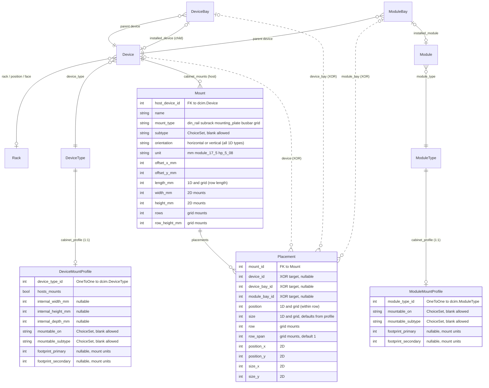

# Architecture

`netbox-cabinet-view` adds four models to NetBox. They attach to the existing core DCIM objects (`Device`, `DeviceType`, `DeviceBay`, `ModuleBay`, `ModuleType`) without modifying any of them.

## Models

- **`DeviceMountProfile`** — per-`dcim.DeviceType` declaration of whether the device hosts mounts (it's a cabinet or enclosure) and/or mounts on other mounts (it's a DIN-mounted relay, a 4-HP Eurocard, a clip-on MCB). Internal dimensions and footprints live here.
- **`ModuleMountProfile`** — per-`dcim.ModuleType` declaration of mount compatibility + footprint. Mirror of `DeviceMountProfile`'s mountable role, scoped to modules. Unlocks correct widths for modular I/O cards, line cards, fibre cassettes, and other plug-in modules.
- **`Mount`** — a geometric mounting structure attached to a host `Device`. Five types: `din_rail`, `subrack`, `mounting_plate`, `busbar`, `grid`. Each has an offset, orientation (horizontal or vertical for any 1D type), length (1D) / width+height (2D) / rows+row_height_mm (grid), and a unit (mm, DIN module 17.5 mm, Eurocard HP 5.08 mm). Grid mounts are 1-to-N stacked rows for modular IED / multi-row backplanes; a placement can span multiple rows via `row_span`.
- **`Placement`** — a device/bay/module placed on a `Mount`. Points at exactly one of:
  - a standalone `dcim.Device` (bare DIN-rail installations)
  - a `dcim.DeviceBay` (chassis with child devices — WDM shelves, blade chassis)
  - a `dcim.ModuleBay` (modular PLC / line-card chassis)

  The three FKs are a three-way XOR — exactly one populated, enforced in `Placement.clean()`.

## Schema diagram

Plugin models in bold. The three dashed relationships from `Placement` are the XOR constraint.

## Why a Placement can target three different things

NetBox already represents three different parent/child relationships:

1. **Direct device placement** — a single standalone device sitting on a rail.
2. **`DeviceBay`-backed child devices** — a chassis like a WDM shelf with two filter modules, where each child is a full `dcim.Device` installed into a `DeviceBay`.
3. **`ModuleBay`-backed modules** — a modular chassis like a PLC backplane or a line-card router, where each module is a `dcim.Module` (not a Device) installed into a `ModuleBay`.

The cabinet-view model treats each as a valid "thing that occupies a mount position", so its geometry layer works uniformly across all three. When the SVG renderer paints a `Placement`, it resolves the XOR target at render time:

- `placement.device_id` → the standalone device's own `DeviceType.front_image`
- `placement.device_bay_id` → `device_bay.installed_device.device_type.front_image`
- `placement.module_bay_id` → `module_bay.installed_module.module_type` (and its profile, for width)

This avoids a parallel "cabinet device" or "cabinet module" hierarchy and keeps the plugin small.

## Validation (`Placement.clean()`)

Beyond the three-way XOR, `Placement.clean()` enforces:

- **Compatibility:** if the placed entity has a `DeviceMountProfile`/`ModuleMountProfile` with `mountable_on` set, it must match the mount's `mount_type` (and `mountable_subtype` must match if declared).
- **Ownership:** for `device_bay`/`module_bay` placements, the bay's parent device must equal the mount's `host_device`. You can't mount a bay from some other device onto this cabinet's mount.
- **Dimension coherence:** 1D mounts require `position` + `size`; 2D mounts require `position_x/y` + `size_x/y`; grid mounts additionally require `row`. Wrong combinations raise a field-level `ValidationError`.
- **Bounds:** position + size must fit inside the mount's capacity.
- **Overlap:** no two placements on the same mount may occupy overlapping slot ranges (1D/grid) or overlapping bounding boxes (2D).
- **Size auto-fill:** if `size` is blank and the placed device/module has a profile with `footprint_primary`, the size defaults from the profile. Slots are conceptually fixed-width; only mounts stretch. `Placement.save()` runs `full_clean()` on every save path so the auto-fill fires for forms, admin, shell, seeds, and API clients alike.
