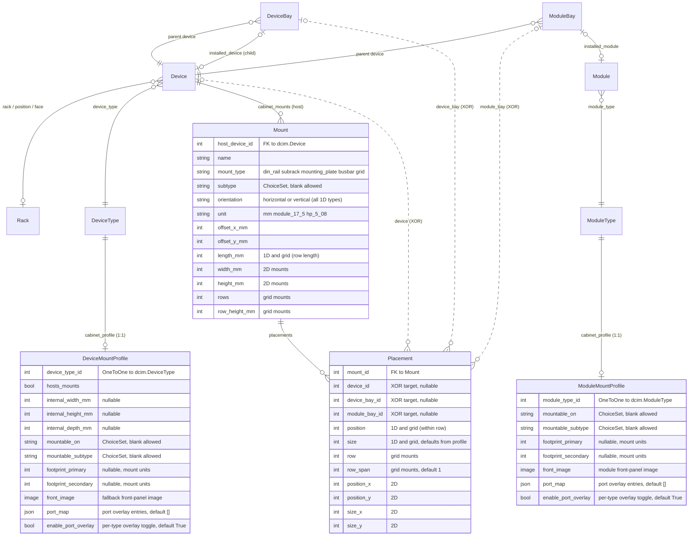

# Architecture

`netbox-cabinet-view` adds four models to NetBox. They attach to the existing core DCIM objects (`Device`, `DeviceType`, `DeviceBay`, `ModuleBay`, `ModuleType`) without modifying any of them.

## Models

- **`DeviceMountProfile`** — per-`dcim.DeviceType` declaration of whether the device hosts mounts (it's a cabinet or enclosure) and/or mounts on other mounts (it's a DIN-mounted relay, a 4-HP Eurocard, a clip-on MCB). Internal dimensions and footprints live here.
- **`ModuleMountProfile`** — per-`dcim.ModuleType` declaration of mount compatibility + footprint. Mirror of `DeviceMountProfile`'s mountable role, scoped to modules. Unlocks correct widths for modular I/O cards, line cards, fibre cassettes, and other plug-in modules.
- **`Mount`** — a geometric mounting structure attached to a host `Device`. Five types: `din_rail`, `subrack`, `mounting_plate`, `busbar`, `grid`. Each has an offset, orientation (horizontal or vertical for any 1D type), length (1D) / width+height (2D) / rows+row_height_mm (grid), and a unit (mm, DIN module 17.5 mm, Eurocard HP 5.08 mm). Grid mounts are 1-to-N stacked rows for modular IED / multi-row backplanes; a placement can span multiple rows via `row_span`.
- **`Placement`** — a device/bay/module placed on a `Mount`. Points at exactly one of:
  - a standalone `dcim.Device` (bare DIN-rail installations)
  - a `dcim.DeviceBay` (chassis with child devices — WDM shelves, blade chassis)
  - a `dcim.ModuleBay` (modular PLC / line-card chassis)

  The three FKs are a three-way XOR — exactly one populated, enforced in `Placement.clean()`.

## Schema diagram

Plugin models in bold. The three dashed relationships from `Placement` are the XOR constraint.



## Why a Placement can target three different things

NetBox already represents three different parent/child relationships:

1. **Direct device placement** — a single standalone device sitting on a rail.
2. **`DeviceBay`-backed child devices** — a chassis like a WDM shelf with two filter modules, where each child is a full `dcim.Device` installed into a `DeviceBay`.
3. **`ModuleBay`-backed modules** — a modular chassis like a PLC backplane or a line-card router, where each module is a `dcim.Module` (not a Device) installed into a `ModuleBay`.

The cabinet-view model treats each as a valid "thing that occupies a mount position", so its geometry layer works uniformly across all three. When the SVG renderer paints a `Placement`, it resolves the XOR target at render time:

- `placement.device_id` → the standalone device's own `DeviceType.front_image`
- `placement.device_bay_id` → `device_bay.installed_device.device_type.front_image`
- `placement.module_bay_id` → `module_bay.installed_module.module_type` (and its profile, for width)

This avoids a parallel "cabinet device" or "cabinet module" hierarchy and keeps the plugin small.

## Validation (`Placement.clean()`)

Beyond the three-way XOR, `Placement.clean()` enforces:

- **Compatibility:** if the placed entity has a `DeviceMountProfile`/`ModuleMountProfile` with `mountable_on` set, it must match the mount's `mount_type` (and `mountable_subtype` must match if declared).
- **Ownership:** for `device_bay`/`module_bay` placements, the bay's parent device must equal the mount's `host_device`. You can't mount a bay from some other device onto this cabinet's mount.
- **Dimension coherence:** 1D mounts require `position` + `size`; 2D mounts require `position_x/y` + `size_x/y`; grid mounts additionally require `row`. Wrong combinations raise a field-level `ValidationError`.
- **Bounds:** position + size must fit inside the mount's capacity.
- **Overlap:** no two placements on the same mount may occupy overlapping slot ranges (1D/grid) or overlapping bounding boxes (2D).
- **Size auto-fill:** if `size` is blank and the placed device/module has a profile with `footprint_primary`, the size defaults from the profile. Slots are conceptually fixed-width; only mounts stretch. `Placement.save()` runs `full_clean()` on every save path so the auto-fill fires for forms, admin, shell, seeds, and API clients alike.

## Port / connector overlay (v0.7.0)

The plugin renders `dcim.Interface`, `dcim.FrontPort`, and `dcim.RearPort` as clickable, status-coloured hotspots on device and module front-panel images in the cabinet SVG.

### Enabling / disabling

The overlay has a **two-level feature flag**:

1. **Global** — `ENABLE_PORT_OVERLAY` in `PLUGINS_CONFIG` (default `True`). When `False`, the overlay is suppressed everywhere regardless of per-profile settings.
2. **Per device type / module type** — `enable_port_overlay` boolean on `DeviceMountProfile` and `ModuleMountProfile` (default `True`). Set to `False` to suppress the overlay on a specific device or module type.

Both must be `True` (and the profile must have a non-empty `port_map`) for the overlay to render.

```python
# configuration.py — global setting
PLUGINS_CONFIG = {
    'netbox_cabinet_view': {
        'ENABLE_PORT_OVERLAY': True,       # master switch (default True)
        'PORT_STATUS_COLORS': {            # customise status colours
            'connected_enabled': '2ecc71',
            'connected_disabled': 'f39c12',
            'unconnected_enabled': '95a5a6',
            'unconnected_disabled': '7f8c8d',
        },
    },
}
```

### `port_map` JSON schema

The `port_map` field on both profile models is a JSON list of overlay entries. Four entry types are supported:

#### `zone` — repetitive port groups

For terminal blocks, DIN-rail spring-cage connectors, or any row of identically-spaced ports:

```json
{
  "type": "zone",
  "name_pattern": "DI-*",
  "edge": "top",
  "start_mm": 3,
  "pitch_mm": 4,
  "count": 8,
  "pin_width_mm": 2,
  "pin_height_mm": 2,
  "protrudes_mm": 3
}
```

| Key | Type | Description |
|-----|------|-------------|
| `name_pattern` | string | fnmatch glob matched against component names (e.g. `DI-*` matches `DI-1`..`DI-8`) |
| `edge` | string | Which edge the pins align to: `left`, `right`, `top`, `bottom` |
| `start_mm` | number | Offset from the edge origin in mm |
| `pitch_mm` | number | Spacing between successive pins in mm |
| `count` | int | Number of pins in this zone |
| `pin_width_mm` | number | Width of each pin rect in mm |
| `pin_height_mm` | number | Height of each pin rect in mm |
| `protrudes_mm` | number | How far the pin extends beyond the device bounding box (0 = flush) |

Matching: interfaces are sorted alphabetically and assigned to zone pins in order. If the device has 8 interfaces named `DI-1`..`DI-8`, the first pin gets `DI-1`, the second `DI-2`, etc.

#### `pin` — individual port at exact coordinates

For Ethernet RJ45 jacks, SFP cages, or any port at a specific position:

```json
{
  "type": "pin",
  "name": "eth-1",
  "x_mm": 20,
  "y_mm": 5,
  "width_mm": 10,
  "height_mm": 8,
  "protrudes_mm": 0
}
```

Matched by exact name to `dcim.Interface.name`, `FrontPort.name`, or `RearPort.name`.

#### `module_bay` — physical module slot position

Defines where a module bay sits on the host device's front-panel image. When the bay has an installed module whose `ModuleMountProfile` has its own `port_map`, the module's pins render offset by the bay position (two-level overlay):

```json
{
  "type": "module_bay",
  "name": "R1S5",
  "x_mm": 140,
  "y_mm": 10,
  "width_mm": 28,
  "height_mm": 110,
  "protrudes_mm": 0
}
```

`name` is matched to `dcim.ModuleBay.name` on the device.

#### `lcd` — management IP display area

Reserved area for the management IP LCD overlay (Feature 3, opt-in via `SHOW_MANAGEMENT_IP`):

```json
{
  "type": "lcd",
  "x_mm": 3,
  "y_mm": 20,
  "width_mm": 24,
  "height_mm": 10
}
```

### Status colours

Each port pin is coloured based on the interface's connection and enabled state:

| State | Default colour | Description |
|-------|---------------|-------------|
| Connected + enabled | `#2ecc71` (green) | Port has a cable or `mark_connected=True`, and is enabled |
| Connected + disabled | `#f39c12` (amber) | Port is connected but administratively disabled |
| Unconnected + enabled | `#95a5a6` (grey) | Port is enabled but has no cable |
| Unconnected + disabled | `#7f8c8d` (dark grey) | Port is disabled and has no cable |

Override via `PORT_STATUS_COLORS` in `PLUGINS_CONFIG`.

### Two-level overlay (modular devices)

For modular devices like IEDs, PLCs, and managed switches with plug-in modules:

1. The **host device's** `DeviceMountProfile.port_map` defines `module_bay` entries — where each physical module slot sits on the device's front-panel image.
2. Each **installed module's** `ModuleMountProfile.port_map` defines `zone`/`pin` entries — where the module's own interfaces sit relative to the module's top-left corner.
3. The renderer composites both layers: module pin positions = bay position + module-relative pin position.

This means you define port positions once per module type and once per device type. Every instance inherits automatically.

### Protruding connectors

When `protrudes_mm > 0` on a zone or pin entry, the pin rect extends beyond the device's bounding box. This is rendered **outside** the placement's SVG clipPath so the pin visually sticks out — matching how real spring-cage terminal blocks protrude from DIN-mount modules. Protruding pins get a subtle drop shadow for depth.

### Drag-to-place (v0.7.0)

Populated placement rects carry `data-placement-pk` and mount geometry attributes. Client-side JavaScript enables drag-to-reposition: grab a device, drag to a new position, and the placement updates via PATCH to the REST API. The ghost rect snaps to the mount's grid (mount units for 1D, mm for 2D, row+position for grid mounts). Click-vs-drag is distinguished by a 5px movement threshold.

### Management IP LCD overlay (v0.7.0, opt-in)

When `SHOW_MANAGEMENT_IP: True` in `PLUGINS_CONFIG`, the renderer draws `device.primary_ip4` as green monospace text on a dark LCD-style background. Position is defined by `lcd` entries in `port_map`, or auto-detected for devices/modules with "cpu" in the name. Off by default.
